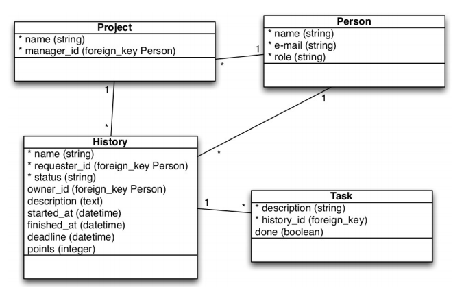

 # Desafio técnico

Desenvolver um sistema em Ruby on Rails com um board para cadastro e controle de histórias, inspirado no mecanismo de colunas e cards do “Trello”.
  * A aplicação deve ser acessível apenas para usuários logados, possuir testes unitários e testes de integração.
  * A interface deve utilizar um template do Bootstrap, e deve contar com recursos que agreguem valor à usabilidade onde relevante: drag and drop, modais, máscaras de data, etc., a critério do candidato.
  * A sequência dos commits deve demonstrar a evolução do projeto; entregar o projeto todo pronto com apenas um commit no final perde muitos pontos. 

## Entregas 
  * link do sistema publicado no Heroku, para navegarmos na versão final. - link do código no Github. 

## Regras para o model History 
  * points: deve aceitar apenas 1, 2, 3, 5, 8 e 13 
  * status válidos: pending, started, delivered e accepted 
  * não pode pular direto para um status fora da sequência, ou seja, pode avançar de pending para started, mas não pode avançar de pending para delivered 
  * ao mudar o status de uma história, o sistema deve registrar num histórico de versionamento o usuário responsável, data e hora e qual alteração foi feita (ex.; { user_id: 12, status: [:accepted, :pending] }) 
  * os botões/links para avançar status nas views devem mostrar apenas o próximo status válido 
  * pode voltar para "pending" a partir de qualquer status 
  * só deve permitir avançar uma história para “done” se todas as taks estiverem marcadas como finalizadas 
  * finished_at / started_at: não pode finalizar numa data menor que a iniciada, etc. 
  
## Modelagem sugerida



---

# Deploy (local) 
###### Certifique-se que seu sistema operacional possui os requisitos para executar este app.

* Rails 5.2.3
* Ruby 2.6.3
* MariaDB 

Após baixar o projeto (clone | zip), utilize o Bundler para instalar as dependencias:
```bash
$ bundle install
```

Edite as credenciais para conectar no banco de dados.
```yaml
# config/database.yml

  host: '127.0.0.1' 
  port: '3306'
  username: 'your_user'
  password: 'your_password'
```  

Crie o banco de dados e execute as migrações.
```bash
$ rake db:create && rake db:migrate
```

Inicie o servidor e acesse pelo navegador.
O app deverá estar acessivel em __http://localhost:3000__
```bash
$ rails server
```

---

## Change log
### 1.0.0-alpha

- [x] Setup do projeto e banco de dados
- [x] Registro e autenticação com _Devise_
- [x] Testes para models (cobertura em regras de negócio)
- [x] CRUD de Project
- [x] Interface do board
- [x] CRUD de Story
- [x] Edição dinamica de Tasks no formulário de Story com _Cocoon_
- [x] "Datepicker" para campos de data com _Tempus Dominus_
- [ ] "Drag in drop" para arrastar "cards" em "pipelines"
- [ ] Edição de "card" em modal
- [ ] Testes funcionais (em views) com _Capybara_
- [ ] Deploy no Heroku
